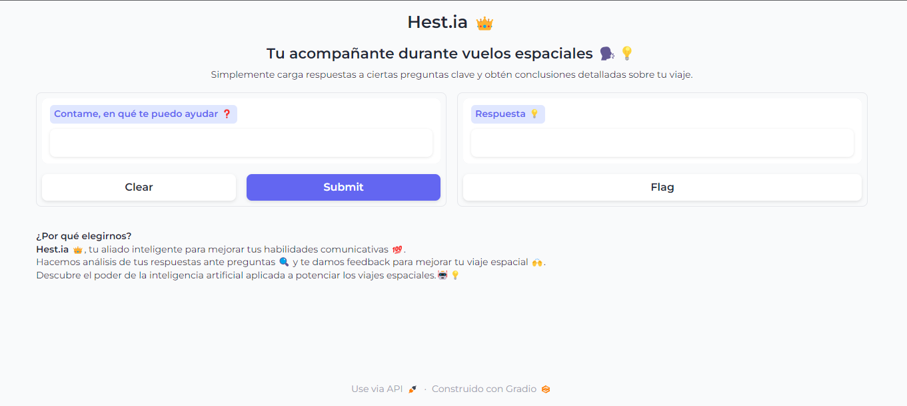

# Hestia
Your partner in space trips 🚀


**Hestia** es tu acompañante terapéutico en el espacio 💯. <br> Es un producto innovador diseñado para abordar uno de los desafíos más importantes de la exploración espacial 🔍: el bienestar emocional y psicológico de nuestros futuros astronautas. 🙌.
<br>Descubre el poder de la inteligencia artificial aplicado a los viajes espaciales.🤖💡

# <br>Tecnologías ⚙️
Este proyecto se ha desarrollado utilizando Python 3.0, Gradio y ChatGPT de OpenAI.
- **Gradio 🖌:** Una biblioteca de interfaz de usuario (UI) de Python que facilita la creación de interfaces de usuario interactivas 
- **ChatGPT 🤖:** Api de Inteligencia Artificial que proporciona modelos de lenguaje y capacidades de procesamiento de texto avanzadas.

# <br>¿Cómo usar el programa? 💻
Para poder **inicializar el programa** desde la consola debes seguir los siguientes pasos:

0) Instala las dependencias: `pip3 install -r requirements.txt`
1) Ejecuta desde la terminal el programa **`app.py`**  
2) Copia la URL y pega en tu navegador. Y ya puedes utilizar la interfaz gráfica (GUI).
<br>

Para **hacer una consulta desde la GUI** debes seguir los siguientes pasos:

1) Ingresa tu **pregunta o inquietud**
2) Haz clic en **"Submmit"**.
3) Espera los resultados.
4) Explora las respuestas y **obten datos curiosos sobre el espacio**.

Si hiciste bien los pasos, deberias obtener un resultado similar al siguiente:



# <br>Nuestra API 📩

**Puedes consumir nuestro servicio también vía API**.
<br>El endpoint es `run/predict` donde puedes hacer peticiones POST con tu data.
<br>Para ver la implementación recurrir a `call_api.py`

# <br>Variables de Entorno 🔑
Para utilizar el programa, es necesario generar tus propias claves de API. Sigue estos pasos para configurar las claves API necesarias:

1) Crea un archivo llamado **.env** en la raíz de tu proyecto

2) Dentro del archivo .env, agrega las credenciales de tu cuenta de OpenAI.
```
# OPEN AI CREDENTIAL
OPENAI_KEY = "Agrega tu OpenAI Api Key"
```

# <br>Convención de commits 🎯
Se utilizó el [Conventional Commits](https://www.conventionalcommits.org/en/v1.0.0/):
una convención de reglas para crear un historial de commits explícito; lo que facilita la escritura de herramientas automatizadas encima. 

# <br> Contacto 🌟
Ante consultas, nos puedes consultar por Linkedin:
- [Carlos Bustillo](https://www.linkedin.com/in/carlos-bustillo/).
- [Mario Bustillo](https://www.linkedin.com/in/mario-bustillo/).